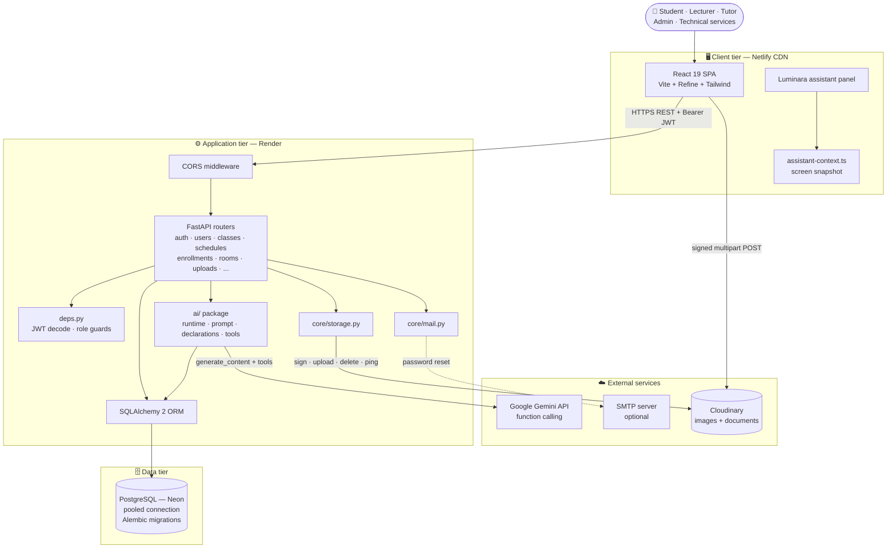
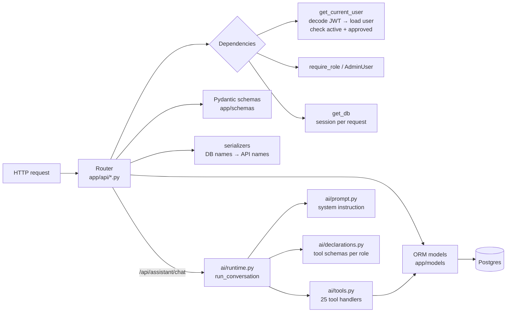
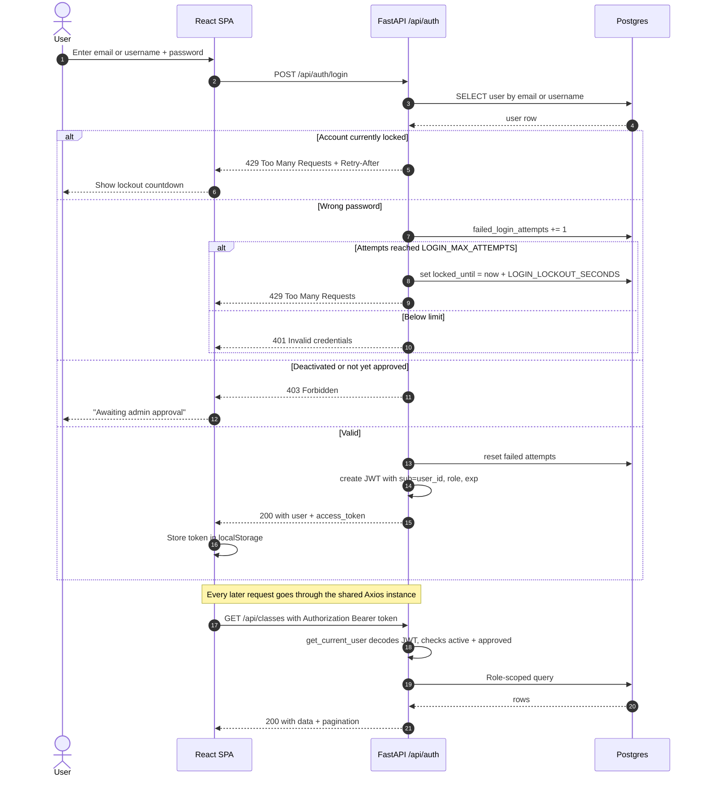
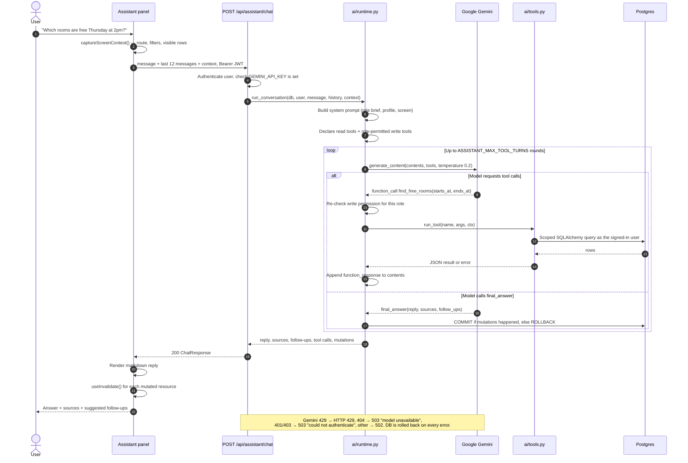
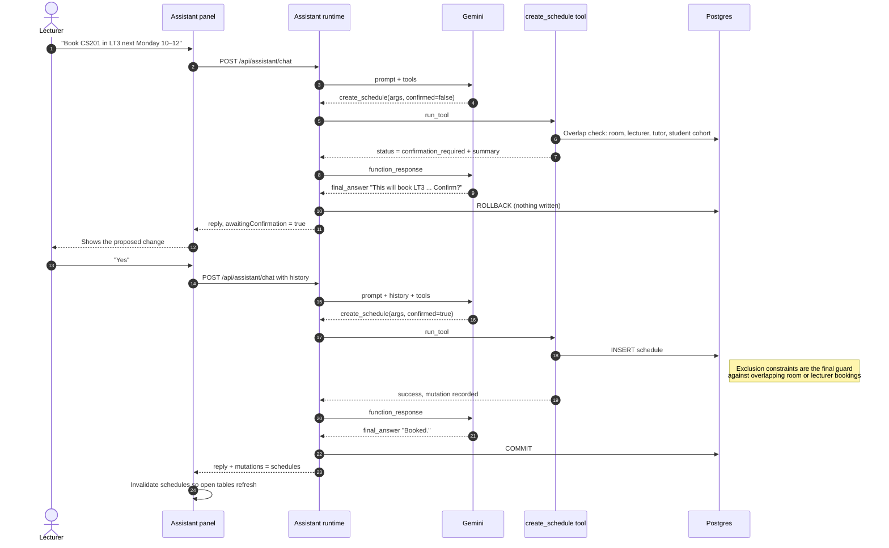
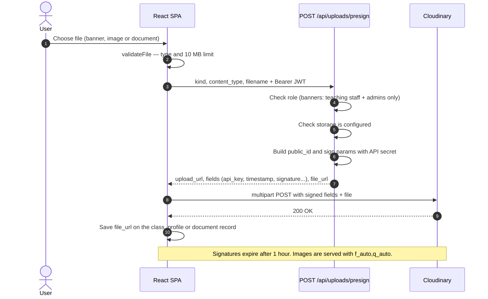
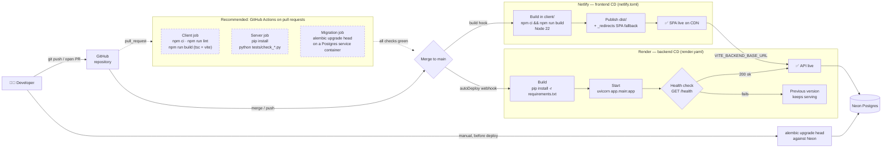

# Architecture

This document explains how Classroom Dashboard is put together: the system architecture, how requests flow through the API (including the GenAI assistant), and how code gets from a commit to production.

All diagrams are written in [Mermaid](https://mermaid.js.org/) and render natively on GitHub.

**Contents**

1. [System architecture](#1-system-architecture)
2. [Backend internals](#2-backend-internals)
3. [API sequence diagrams](#3-api-sequence-diagrams)
   - [3.1 Login and authenticated requests](#31-login-and-authenticated-requests)
   - [3.2 AI assistant chat with tool calling](#32-ai-assistant-chat-with-tool-calling)
   - [3.3 Assistant write with two-phase confirmation](#33-assistant-write-with-two-phase-confirmation)
   - [3.4 Direct-to-Cloudinary file upload](#34-direct-to-cloudinary-file-upload)
4. [CI/CD pipeline](#4-cicd-pipeline)
5. [Key design decisions](#5-key-design-decisions)

---

## 1. System architecture

### Explanation

**Client tier.** The frontend is a static single-page app built with Vite and served from Netlify's CDN. [Refine](https://refine.dev) provides the data and auth providers, so pages use hooks like `useTable` and `useOne` that map onto the REST API's `{ data, pagination }` envelope. A shared Axios instance attaches the JWT from `localStorage` to every request. The Luminara panel lives in the app layout, so it's available on every page.

**Application tier.** A single FastAPI service on Render holds all business logic. Each resource has its own router under `app/api/`. Authentication and authorisation are FastAPI dependencies (`CurrentUser`, `AdminUser`, `require_role(...)`), so every route declares who may call it. The GenAI assistant is not a separate service: it's a Python package (`app/ai/`) inside the same process, sharing the same database session, models and permission helpers as the REST routers.

**Data tier.** PostgreSQL on Neon, accessed through the pooled connection string to stay within free-tier connection limits. The schema is versioned with Alembic. Scheduling integrity is enforced at the database level with `btree_gist` exclusion constraints that make overlapping room or lecturer bookings impossible, even if application code has a bug.

**External services.**
- **Gemini** is called only from the backend. The API key never reaches the browser.
- **Cloudinary** stores banners, profile pictures and documents. The backend signs upload requests and the browser sends files straight to Cloudinary, so large files never pass through the API server.
- **SMTP** is optional. Without it, password-reset links are written to the server log.

---

## 2. Backend internals

| Module | Responsibility |
| --- | --- |
| `app/main.py` | Creates the FastAPI app, configures CORS, mounts all routers, exposes `/health` |
| `app/api/deps.py` | JWT validation, user loading with eager-loaded profiles, role guards |
| `app/api/*.py` | One router per resource: validation, permission checks, queries, responses |
| `app/schemas/` | Pydantic request and response models; `serialization_alias` maps DB field names (`name`, `phone`, `technical`) to client names (`full_name`, `phone_number`, `technical_services`) |
| `app/models/` | SQLAlchemy models: users and profiles, faculties, departments, programmes, subjects, classes, enrollments, buildings, rooms, schedules, notifications, documents, password-reset tokens |
| `app/core/` | Settings (`pydantic-settings`), password hashing and JWT, Cloudinary client, SMTP mailer |
| `app/ai/runtime.py` | The tool-calling loop, transaction handling and response shaping |
| `app/ai/prompt.py` | Builds the system instruction from the user's role, profile and current screen |
| `app/ai/declarations.py` | Gemini function schemas and the per-role write-tool allow-list |
| `app/ai/tools.py` | Tool implementations: scoped SQLAlchemy queries that respect the same visibility rules as the REST API |

### Assistant write permissions by role

| Role | Write tools offered to the model |
| --- | --- |
| Student | `join_class_by_invite_code`, `remove_enrollment`, `mark_notifications_read`, `update_my_profile` |
| Tutor | Student set (minus join) + `enroll_student`, `update_class`, `create_schedule`, `update_schedule`, `cancel_schedule` |
| Lecturer | Tutor set + `create_class` |
| Admin / Technical services | All 11 write tools |

All roles get all 14 read tools, but each read tool filters its results by the caller's visibility (for example, students only ever see teaching staff in `search_people`).

---

## 3. API sequence diagrams

### 3.1 Login and authenticated requests

Shows credential checking, brute-force lockout, the approval gate for new accounts, and how the JWT is used on later calls.

### 3.2 AI assistant chat with tool calling

The core GenAI flow. The model never sees the database directly; it can only call declared tools, and the backend executes them as the signed-in user.

If the loop runs out of rounds without a `final_answer`, the runtime rolls back and returns a polite "try narrowing the question" reply rather than an error.

### 3.3 Assistant write with two-phase confirmation

Every write tool has a `confirmed` flag. The first call never changes data; it returns a summary that the model must relay to the user.

### 3.4 Direct-to-Cloudinary file upload

Files go straight from the browser to Cloudinary. The API only signs the request, so the Cloudinary secret stays on the server and large files never pass through Render.

---

## 4. CI/CD pipeline

The project uses **Git-driven continuous deployment**: pushing to `main` triggers independent builds on Render (API) and Netlify (SPA). Database migrations are run manually from a developer machine before deploying a change that needs them.

The dashed nodes show a **recommended CI stage** using GitHub Actions. It isn't in the repository yet, but adding it would stop broken code from reaching production, since both platforms currently deploy whatever lands on `main`.

### Pipeline stages

| Stage | Where | What happens | Failure behaviour |
| --- | --- | --- | --- |
| **Source** | GitHub | Push or merge to `main` fires webhooks to Render and Netlify | — |
| **CI** *(recommended)* | GitHub Actions | Lint, type-check and build the client; run backend check scripts against in-memory SQLite; apply migrations to a throwaway Postgres | PR blocked from merging |
| **Migrate** | Developer machine | `alembic upgrade head` against Neon's pooled URL, deliberately not run inside the app process | Deploy should wait |
| **Backend build** | Render | `pip install -r requirements.txt` from `server/` | Deploy aborted, previous version keeps running |
| **Backend release** | Render | `uvicorn` starts; Render polls `/health` before switching traffic | Unhealthy release never receives traffic |
| **Frontend build** | Netlify | `npm ci && npm run build` from `client/` on Node 22; `VITE_BACKEND_BASE_URL` injected at build time | Deploy aborted, previous version keeps serving |
| **Frontend release** | Netlify | `dist/` published atomically to the CDN; hashed `/assets/*` cached for 1 year | Instant rollback available in the Netlify UI |
| **Verify** | Manual | `/health`, admin `/api/system/status`, `/docs`, and a hard refresh on a nested route | — |

### Secrets and configuration

| Secret | Lives in | Never in |
| --- | --- | --- |
| `DATABASE_URL`, `GEMINI_API_KEY`, `CLOUDINARY_*`, `SMTP_*` | Render environment (`sync: false`, entered on first deploy) | Git, Netlify, browser |
| `JWT_SECRET` | Generated by Render (`generateValue: true`) | Anywhere else |
| `VITE_BACKEND_BASE_URL` | Netlify environment (public, compiled into the bundle) | — |

`FRONTEND_URL` on Render and `VITE_BACKEND_BASE_URL` on Netlify point at each other, so the first deployment is done in order: Render with a placeholder `FRONTEND_URL`, then Netlify, then update `FRONTEND_URL` and redeploy Render. See [DEPLOYMENT.md](../DEPLOYMENT.md) for the full walkthrough.

---

## 5. Key design decisions

**Assistant inside the API, not a separate service.** An earlier version ran the assistant as a Node/Express service with fixture data. Merging it into FastAPI lets tools reuse the exact models, permission helpers and overlap queries the REST API uses, so the assistant can't drift from the API's rules, and there's one fewer service to deploy.

**Tools instead of retrieval or prompt-stuffed data.** The prompt contains no institution data. Every fact comes from a tool call, which keeps answers current, keeps the prompt small, and means data access is governed by code rather than by instructions to the model.

**Defence in depth for writes.** Writes pass four independent gates: the role allow-list decides which tools are declared; the runtime re-checks permission on every call; each tool requires `confirmed=true`; and database constraints reject anything that still conflicts. The request's transaction commits only if a mutation succeeded.

**Own tool loop instead of automatic function calling.** The runtime disables the SDK's automatic function calling and runs its own loop. That gives explicit control over the round limit (important on the Gemini free tier), permission checks, error mapping and transaction boundaries.

**Signed direct uploads.** Sending files from the browser to Cloudinary keeps large payloads off the free-tier API server and keeps the storage secret out of the frontend.

**Integrity in the database.** Postgres exclusion constraints on `schedules` guarantee no double-booked rooms or lecturers, even under concurrent requests that would race past an application-level check.

**Stateless JWT auth.** Tokens carry the user id and role, which fits a single stateless API instance that may sleep and wake on the free tier. The trade-off is that tokens can't be revoked early; the `is_active` and `is_approved` checks on every request limit the impact.
